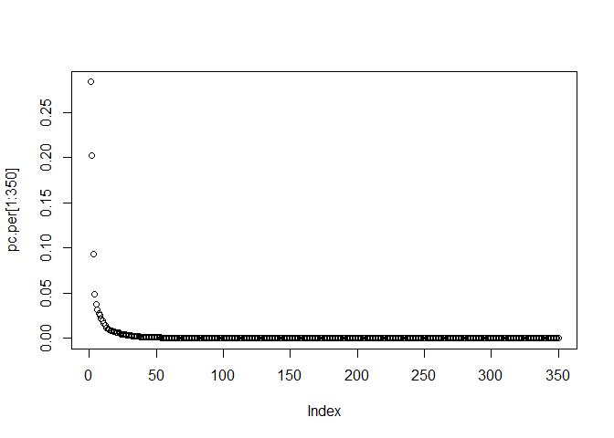
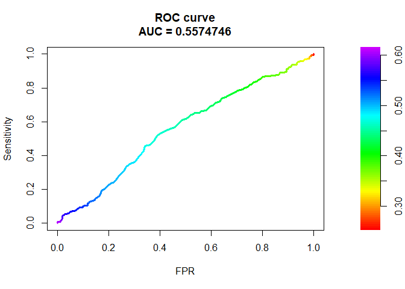
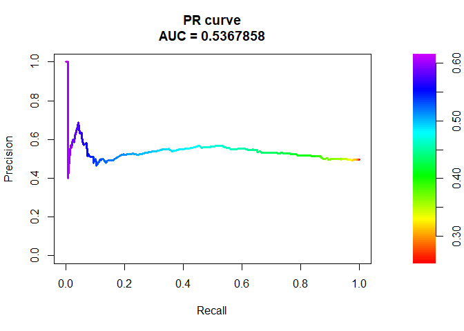
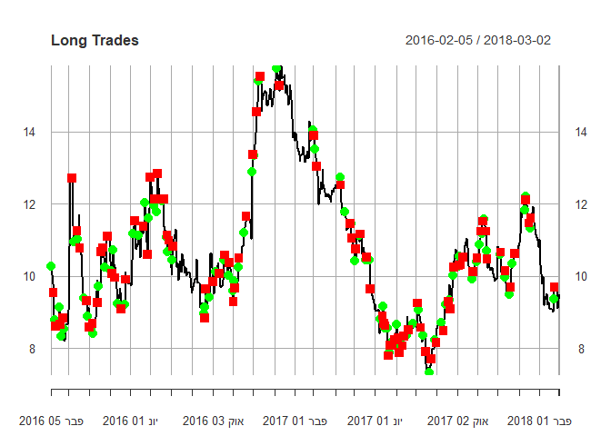
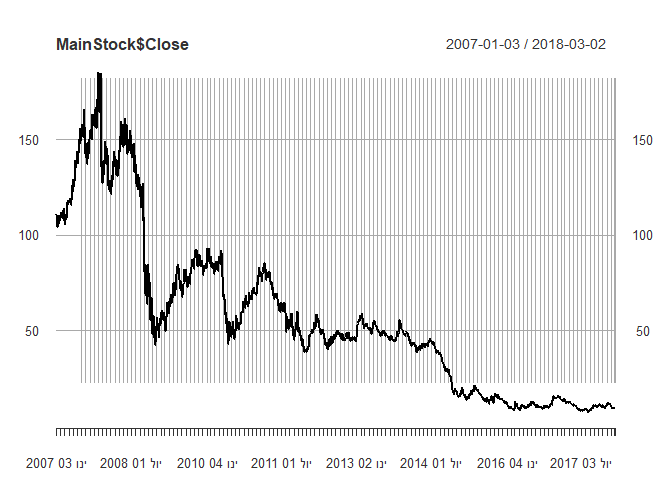
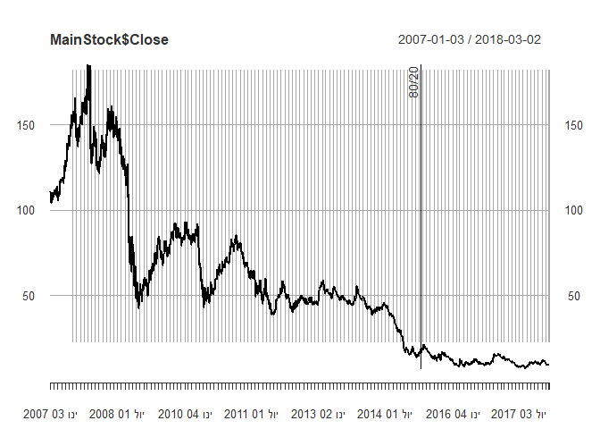
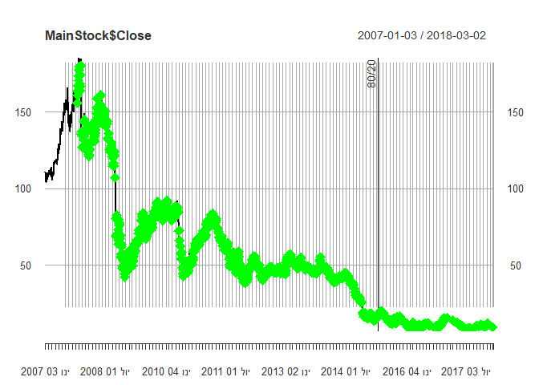

Stocks Market Prediction-classification in R
================
Ori Dahari,Eyal Gat, Mor Anavi
Feb 2018

Abstract:
---------

#### Predict the stock's behavior from S&P 500 Index at different times (over 1, 30 and 60 days) in order to see if the stock price will rise.

#### Comperes classification models such as RF, GBM, and logistic regression in order to get the best result for each Stocks

Feature engineering :Function that add to the data frame the Relations between variables and technical indicators

``` r
add.data.frame <- function(Split.df){

 
 #Change between yesterday close-today close
yesterday_closePrice= shift(v=as.numeric(Split.df$Close), places=1, dir="right")
Change= (Split.df$Close-yesterday_closePrice)/yesterday_closePrice*100
Change[1]=0

  #Change between yesterday close-today open price
Open_Change= (Split.df$Open-yesterday_closePrice)/yesterday_closePrice*100
Open_Change[1]=0

#Change between yesterday todey open-today close price
Change_Within= Change-Open_Change

#Ratio between high,low,open,close
High_Close= Split.df$High/Split.df$Close

Low_Close=  Split.df$Low/ Split.df$Close

High_Low=  Split.df$High/ Split.df$Low

High_Open=  Split.df$High/ Split.df$Open

Low_Open=  Split.df$Low/ Split.df$Open

EMA.Fast <- EMA(Split.df$Close, n=20)
EMA.Medium <- EMA(Split.df$Close, n=120) 
EMA.Slow <- EMA(Split.df$Close, n=200) 
EMA.10=  EMA(Split.df$Close, n=10)
EMA.50= EMA(Split.df$Close, n=50)
EMA.80= EMA(Split.df$Close, n=80)
EMA.100= EMA(Split.df$Close, n=100)
EMA.150= EMA(Split.df$Close, n=150)
fast_detrend_ma <- EMA.Fast - EMA.Medium
slow_detrend_ma <- EMA.Medium - EMA.Slow
CCI.IND <- CCI(HLC=Split.df[,c("High","Low","Close")],n=100)
RSI.Fast <- RSI(price=Split.df$Close,n=10)
RSI.Slow <- RSI(price=Split.df$Close,n=100)
RSI.Medium= RSI(price=Split.df$Close,n=30)
RSI.14= RSI(price=Split.df$Close,n=14)
RSI.50= RSI(price=Split.df$Close,n=50)
RSI.80= RSI(price=Split.df$Close,n=80)
RSI.Diff.Med <- RSI.Medium-RSI.Slow
RSI.Diff.Fast <- RSI.Fast-RSI.Medium
ROC.Fast <- ROC(Split.df$Close,n=10)
ROC.Medium <- ROC(Split.df$Close,n=100)
ROC.Slow <- ROC(Split.df$Close,n=200)
ROC.Diff <- ROC.Fast-ROC.Medium
ROC.Diff.Medium <- ROC.Medium-ROC.Slow
CV.IND=chaikinVolatility(HL=Split.df[,c("High","Low")],n=100)

Split.df <- data.frame(Split.df[],Change,Open_Change,Change_Within,High_Close,Low_Close,High_Low,High_Open,Low_Open,EMA.Fast,EMA.Medium,EMA.Slow, fast_detrend_ma,slow_detrend_ma,CCI.IND,RSI.Fast,RSI.Slow,RSI.Diff.Med,RSI.Diff.Fast,ROC.Fast,ROC.Slow,ROC.Diff,EMA.10,EMA.50,EMA.80,EMA.100,EMA.150,CV.IND,RSI.14,RSI.50,RSI.80,RSI.Medium,ROC.Medium,ROC.Diff.Medium)


return(Split.df)
  
}
```

Feature engineering: Add to data frame more technical indicators of the stock

``` r
addInd<- function(data2){
  
    data2$LogClose <- log(data2$Close)  
  data2$MACD <- MACD(data2$Close)
 data2$will <- williamsAD(data2[,c("High","Low","Close")])
 data2$cci <-  CCI(data2[,c("High","Low","Close")])
 data2$STOCH <- stoch(data2[,c("High","Low","Close")])
 data2$Aroon <- aroon(data2[, c("High","Low")])
 data2$ATR <- ATR(data2[,c("High","Low","Close")]) 
data2$stoch<-stoch(data2[, c("High","Low","Close")], nFastK = 14,nFastD = 3,nSlowD = 3,bounded = TRUE,smooth = 1)
data2$obv=OBV(data2[, c("Close")],data2[, c("Volume")])
 data2$SMI <- SMI(data2[, c("High","Low","Close")])
 data2$BB <- BBands(data2[, c("High","Low","Close")])
 data2$ChaikinVol <-Delt(chaikinVolatility(data2[, c("High","Low")]))
 data2$CLV <- EMA(CLV(data2[, c("High","Low","Close")]))
 data2$Volatility <- volatility(data2[, c("Open","High","Low","Close")], calc="garman")
  
 return(data2)
  
}
```

Function that compute the Y prediction - The range we are trying to predict, whether the stock price will rise within that range: This example - The classification factor is: 1 - tomorrow the price will rise | 0 - otherwise

``` r
computeY <- function(df){
 boolean=FALSE
  
   for(i in 1:1){
     closePriceXdays=shift(v=as.numeric(df$Close ), places=i, dir="left")
       boolean = boolean | (closePriceXdays-df$Close)/df$Close*100>0
    }
    
  vectorY=ifelse(boolean ,1,0)
  
 return( vectorY )
  
  
}
```

Function that help to display the results of each prediction(add row to prediction table):

``` r
add.prediction.row <- function(Sym,model,summary_data,cross.table11,cross.table12,cross.table21,cross.table22){

 return( cbind(Sym,model,summary_data,cross.table11,cross.table12,cross.table21,cross.table22) )
  
  
}
```

Function that Calculate the Profit and Loss using the predict model:

``` r
ProfitLoss_Calculator <- function(objDF) {
        # make column names generic so they can handle any symbol
        
        
        current_long <- 0
        current_short <- 0
        
        for (ind in seq(1,nrow(objDF))) {
                if (!is.na( objDF$Long_Trades[ind])) {
                        # first trade should be an entry, last trade an exit
                        if ((current_long==0 & objDF$Long_Trades[ind] > 0) | (current_long !=0)) {
                                # next trade should be opposite sign of previous trade (entry -> exit)
                                if (sign(objDF$Long_Trades[ind]) != sign(current_long)) {
                                        current_long <- as.numeric(objDF$Long_Trades[ind])
                                        print(paste('Long', current_long))
                                }
                        }
                
                        if (current_long != as.numeric(objDF$Long_Trades[ind]))
                                objDF$Long_Trades[ind] <- 0
                }
       
          
              #  if (objDF$Short_Trades[ind] !=0) {
                        # first trade should be an entry
               #         if ((current_short==0 & objDF$Short_Trades[ind] > 0) | (current_short !=0)) {
                                # next trade should be opposite sign of previous trade (entry -> exit)
                #                if (sign(objDF$Short_Trades[ind]) != sign(current_short)) {
                 #                       current_short <- as.numeric(objDF$Short_Trades[ind])
                  #                      print(paste('Short', current_short))
                   #             }
                    #    }
                     #   if (current_short != as.numeric(objDF$Short_Trades[ind]))
                      #          objDF$Short_Trades[ind] <- 0
                }
 
        
        # trim to be even, if not add last close held in chart
        if ((!length(objDF$Long_Trades[objDF$Long_Trades != 0])%% 2) == 0){
               objDF$Long_Trades[length(objDF$Close)] <- -1 * objDF$Close[length(objDF$Close)]
               current_long=-1 * objDF$Close[length(objDF$Close)]
        }
      #  if ((!length(objDF$Short_Trades[objDF$Short_Trades != 0])%% 2) == 0)
      #         objDF$Short_Trades[length(objDF$Close)] <- -1 * objDF$Close[length(objDF$Close)]
      #  View(objDF$Long_Trades)
        print(paste('Final Longs:',round(sum(objDF$Long_Trades * -1 , na.rm = TRUE),2)))
     #   print(paste('Final Shorts:',round(sum(objDF$Short_Trades),2)))
        
        earn=(-1*current_long-(-1*current_long-(round(sum(objDF$Long_Trades * -1 , na.rm = TRUE),2))) ) / (-1*current_long-(round(sum(objDF$Long_Trades * -1 , na.rm = TRUE),2)))*100
        
        print(paste('yield:',earn))
        print(paste('yield per day:',earn/(length(objDF$Long_Trades)- sum(is.na(objDF$Long_Trades)))))
        # plot trade entries and exits
      #  par(mfrow=c(2,1))
        
        plot(objDF$Close ,main='Long Trades', subset="")
        events <- xts("80/20", 
              (c(index(MainStock[bound,]))))
        addEventLines(events, srt=90, pos=2,lty = 1, lwd = 1, col = 1)
        
        points(ifelse(objDF$Long_Trades > 0, objDF$Long_Trades, NA), col='green', cex=1.5, pch=16)
        points(ifelse(objDF$Long_Trades < 0, objDF$Long_Trades * -1, NA), col='red', cex=1.5, pch=15)
        
      #  plot(objDF, main='Short Trades')
       # points(ifelse(objDF$Short_Trades > 0, objDF$Short_Trades, NA), col='green', cex=1.5, pch=16)
        #points(ifelse(objDF$Short_Trades < 0, objDF$Short_Trades * -1, NA), col='red', cex=1.5, pch=15)
}
```

Group of stocks:

``` r
name = c(  "A", "AAL", "AAP", "AAPL", "ABBV", "ABC", "ABT", "ACN", "ADBE", "ADI", "ADM", "ADP", "ADS", "ADSK", "AEE", "AEP", "AES", "AET", "AFL", "AGN", "AIG", "AIV", "AIZ", "AJG", "AKAM", "ALB", "ALK", "ALL", "ALLE", "ALXN", "AMAT", "AME", "AMG", "AMGN", "AMP", "AMT", "AMZN", "AN", "ANTM", "AON", "APA", "APC", "APD", "APH", "ARNC", "ATVI", "AVB", "AVGO", "AVY", "AWK", "AXP", "AYI", "AZO", "BA", "BAC", "BAX", "BBBY", "BBT", "BBY", "BDX", "BEN", "BIIB", "BK", "BLK", "BLL", "BMY", "BSX", "BWA", "BXP", "C", "CA", "CAG", "CAH", "CAT", "CB", "CBG", "CBOE", "CBS", "CCI", "CCL", "CELG", "CERN", "CF", "CFG", "CHD", "CHK", "CHRW", "CHTR", "CI", "CINF", "CL", "CLX", "CMA", "CMCSA", "CME", "CMG", "CMI", "CMS", "CNC", "CNP", "COF", "COG", "COL", "COO", "COP", "COST", "COTY", "CPB", "CRM", "CSCO", "CSRA", "CSX", "CTAS", "CTL", "CTSH", "CTXS", "CVS", "CVX", "CXO", "D", "DAL", "DE", "DFS", "DG", "DGX", "DHI", "DHR", "DIS", "DISCA", "DISCK", "DLPH", "DLR", "DLTR", "DNB", "DOV", "DPS", "DRI", "DTE", "DUK", "DVA", "DVN", "EA", "EBAY", "ECL", "ED", "EFX", "EIX", "EL", "EMN", "EMR", "EOG", "EQIX", "EQR", "EQT", "ES", "ESRX", "ESS", "ETFC", "ETN", "ETR", "EVHC", "EW", "EXC", "EXPD", "EXPE", "EXR", "F", "FAST", "FB", "FBHS", "FCX", "FDX", "FE", "FFIV", "FIS", "FISV", "FITB", "FL", "FLIR", "FLR", "FLS", "FMC", "FOX", "FOXA", "FRT", "FSLR", "FTI", "FTR", "FTV", "GD", "GE", "GGP", "GILD", "GIS", "GLW", "GM", "GOOG", "GOOGL", "GPC", "GPN", "GPS", "GRMN", "GS", "GT", "GWW", "HAL", "HAS", "HBAN", "HBI", "HCA", "HCN", "HCP", "HD", "HES", "HIG", "HOG", "HOLX", "HON", "HP", "HPE", "HPQ", "HRB", "HRL", "HRS", "HSIC", "HST", "HSY", "HUM", "IBM", "ICE", "IDXX", "IFF", "ILMN", "INCY", "INTC", "INTU", "IP", "IPG", "IR", "IRM", "ISRG", "ITW", "IVZ", "JBHT", "JCI", "JEC", "JNJ", "JNPR", "JPM", "JWN", "K", "KEY", "KHC", "KIM", "KLAC", "KMB", "KMI", "KMX", "KO", "KORS", "KR", "KSS", "KSU", "L", "LB", "LEG", "LEN", "LH", "LKQ", "LLL", "LLY", "LMT", "LNC", "LNT", "LOW", "LRCX", "LUK", "LUV", "LYB", "M", "MA", "MAA", "MAC", "MAR", "MAS", "MAT", "MCD", "MCHP", "MCK", "MCO", "MDLZ", "MDT", "MET", "MHK", "MKC", "MLM", "MMC", "MMM", "MNK", "MNST", "MO", "MON", "MOS", "MPC", "MRK", "MRO", "MS", "MSFT", "MSI", "MTB", "MTD", "MU", "MUR", "MYL", "NAVI", "NBL", "NDAQ", "NEE", "NEM", "NFLX", "NFX", "NI", "NKE", "NLSN", "NOC", "NOV", "NRG", "NSC", "NTAP", "NTRS", "NUE", "NVDA", "NWL", "NWS", "NWSA", "O", "OKE", "OMC", "ORCL", "ORLY", "OXY", "PAYX", "PBCT", "PCAR", "PCG", "PCLN", "PDCO", "PEG", "PEP", "PFE", "PFG", "PG", "PGR", "PH", "PHM", "PKI", "PLD", "PM", "PNC", "PNR", "PNW", "PPG", "PPL", "PRGO", "PRU", "PSA", "PSX", "PVH", "PWR", "PX", "PXD", "PYPL", "QCOM", "QRVO", "R", "RCL", "REG", "REGN", "RF", "RHI", "RHT", "RIG", "RL", "ROK", "ROP", "ROST", "RRC", "RSG", "RTN", "SBUX", "SCG", "SCHW", "SEE", "SHW", "SIG", "SJM", "SLB", "SLG", "SNA", "SNI", "SO", "SPG", "SPGI", "SRCL", "SRE", "STI", "STT", "STX", "STZ", "SWK", "SWKS", "SWN", "SYF", "SYK", "SYMC", "SYY", "T", "TAP", "TDC", "TDG", "TEL", "TGNA", "TGT", "TIF", "TJX", "TMK", "TMO", "TRIP", "TROW", "TRV", "TSCO", "TSN", "TSS", "TWX", "TXN", "TXT", "UA", "UAA", "UAL", "UDR", "UHS", "ULTA", "UNH", "UNM", "UNP", "UPS", "URBN", "URI", "USB", "UTX", "V", "VAR", "VFC", "VIAB", "VLO", "VMC", "VNO", "VRSK", "VRSN", "VRTX", "VTR", "VZ", "WAT", "WBA", "WDC", "WEC", "WFC", "WHR", "WLTW", "WM", "WMB", "WMT", "WRK", "WU", "WY", "WYN", "WYNN", "XEC", "XEL", "XL", "XLNX", "XOM", "XRAY", "XRX", "XYL", "YUM", "ZBH", "ZION", "ZTS")
```

For each Stock in the list:
1. build the data
2. run RF,GLM and GBM predict models
3. Collect the results of each model
In this part we present the process for only 5 Stocks:

``` r
#install.packages('quantmod')
#install.packages('binhf')
#library(binhf)
#library(quantmod)
#library(xts)

set.seed(19)
name=sample(name)
Stock.Group=as.character(name[1:5])   # Choose random stocks from the name list
All.Stocks.Prediction=data.frame()    # data frame that hold the results of all the models per stock

for(i in 1:length(Stock.Group)){
    upOrDown=c()
 sink( tempfile() )
     getSymbols(Stock.Group[i], src='yahoo')   #get the history data of specific stock from yahoo finance
    sink()
     MainStock=na.omit(get(Stock.Group[i]))
    if(length(MainStock[,1])>1500){
    colnames(MainStock) <- c("Open", "High", "Low", "Close", "Volume", "Adj")
    Stock=MainStock
    
    ## preper the data:
    Stock=addInd(Stock)
    Stock=add.data.frame(Stock)
    ##Choose what to predict (build Y)
    Stock$Up_Down=computeY(Stock)
    Stock=na.omit(Stock[1:(nrow(Stock)-1),])
    colUP_Down=colnames(Stock)=='Up_Down'
    upOrDown= append(upOrDown, Stock[, colUP_Down])
   
    form <- Stock$Up_Down ~ .^2
    options(na.action="na.pass")
    Stock = model.matrix(form, data = Stock)
    Stock=Stock[,-c(1)]
    
    
    removeSymbols(Symbols=Stock.Group[i],env=.GlobalEnv)


##PcA

pc = prcomp(Stock, center = TRUE, scale. = TRUE) 
pc.var =pc$sdev ^2
pc.per = pc.var/sum(pc.var)
#plot(pc.per[1:30])

Up_Down=upOrDown
Stock<-data.frame(Up_Down,pc$x[,1:30])


   # Split to train 80% and test 20%
  bound <- floor((nrow(Stock)/5)*4)
  df.train <- Stock[1:bound, ]
    df.test <- Stock[(bound+1):nrow(Stock), ]
    
    ### Random Forest (RF)
    #### Model learning on Train data
    #### Run the tree model for all predictors, and then view the model summary and plot:
    
    #install.packages("randomForest")
    #library(randomForest)
    
    set.seed(9) #RF includes random selection. Repeat same seed to repeat the RF
    Stock.RF <- randomForest(factor(Up_Down) ~. , data = df.train ,na.action=na.exclude) #Train with all predictors
    fitted.results.RF=predict(Stock.RF,df.test, type = "prob")
     #summary(fitted.results.RF)
    
   # plot(Stock.RF)
    #importance(Stock.RF)
   # varImpPlot(Stock.RF)
    
    threshold <- 0.6
    prediction <- ifelse(fitted.results.RF[,2] > threshold,1,0)
 

    cross.table <- table(prediction, df.test$Up_Down )
   
    if((dim( cross.table)[1]+dim( cross.table)[2])==4){
    
    ###From the table you can calculate manualy all KPIs:
    
    acc=(cross.table[1,1]+cross.table[2,2])/ (cross.table[1,1]+cross.table[2,2]+cross.table[1,2]+cross.table[2,1]) #accuracy 
    prec=cross.table[2,2]/(cross.table[2,2]+cross.table[2,1]) #precision
    rec=cross.table[2,2]/(cross.table[2,2]+cross.table[1,2]) #Recall
    
    summary_data=data.frame(Accuracy=acc ,Precision=prec , Recall=rec)
   
    All.Stocks.Prediction=rbind(All.Stocks.Prediction,add.prediction.row(Stock.Group[i],"RF",summary_data,cross.table[1,1],cross.table[1,2],cross.table[2,1],cross.table[2,2]))

    }
     
  

    ###GBM:
    threshold <- 0.6
    set.seed(7) #GBM includes random selection. Repeat same seed to repeat the RF
    sink( tempfile() )
    Stock.GBM <- gbm (Up_Down ~ . , data = df.train, n.trees = 1000, interaction.depth = 4, shrinkage = 0.2, verbose = F) #gbm 
   sink()
     fitted.results.GBM <- predict(Stock.GBM,df.test, n.trees = 1000, type="response")
      prediction.GBM <- ifelse(fitted.results.GBM > threshold,1,0)
 
    cross.table.GBM <- table(prediction.GBM, df.test$Up_Down )
    if((dim( cross.table.GBM)[1]+dim( cross.table.GBM)[2])==4){
   
    ###From the table you can calculate manualy all KPIs:
    
    acc.GBM=(cross.table.GBM[1,1]+cross.table.GBM[2,2])/ (cross.table.GBM[1,1]+cross.table.GBM[2,2]+cross.table.GBM[1,2]+cross.table.GBM[2,1]) #accuracy 
    prec.GBM=cross.table.GBM[2,2]/(cross.table.GBM[2,2]+cross.table.GBM[2,1]) #precision
    rec.GBM=cross.table.GBM[2,2]/(cross.table.GBM[2,2]+cross.table.GBM[1,2]) #Recall
    
    summary_data.GBM=data.frame(Accuracy=acc.GBM ,Precision=prec.GBM , Recall=rec.GBM)
    summary_data.GBM 
    
    All.Stocks.Prediction=rbind(All.Stocks.Prediction,add.prediction.row(Stock.Group[i],"GBM",summary_data.GBM,cross.table.GBM[1,1],cross.table.GBM[1,2],cross.table.GBM[2,1],cross.table.GBM[2,2]))
    }  
    
    #Logistic regression
    
    Stock.logit <- glm(Up_Down ~ ., data = df.train, family = binomial)
    fitted.results.logit <- predict(Stock.logit,df.test,type='response')
    threshold <- 0.6
    prediction.logit <- ifelse(fitted.results.logit > threshold,1,0)
    cross.table.logit <- table(prediction.logit, df.test$Up_Down )
   if((dim( cross.table.logit)[1]+dim( cross.table.logit)[2])==4){
        acc.logit=(cross.table.logit[1,1]+cross.table.logit[2,2])/ (cross.table.logit[1,1]+cross.table.logit[2,2]+cross.table.logit[1,2]+cross.table.logit[2,1]) #accuracy 
    prec.logit=cross.table.logit[2,2]/(cross.table.logit[2,2]+cross.table.logit[2,1]) #precision
    rec.logit=cross.table.logit[2,2]/(cross.table.logit[2,2]+cross.table.logit[1,2]) #Recall
    
    summary_data.logit=data.frame(Accuracy=acc.logit ,Precision=prec.logit , Recall=rec.logit)
    summary_data.logit  
    
     All.Stocks.Prediction=rbind(All.Stocks.Prediction,add.prediction.row(Stock.Group[i],"GLM",summary_data.logit,cross.table.logit[1,1],cross.table.logit[1,2],cross.table.logit[2,1],cross.table.logit[2,2]))
   }
    }
    else {removeSymbols(Symbols=Stock.Group[i],env=.GlobalEnv)}
    
    }  
```

    ## 'getSymbols' currently uses auto.assign=TRUE by default, but will
    ## use auto.assign=FALSE in 0.5-0. You will still be able to use
    ## 'loadSymbols' to automatically load data. getOption("getSymbols.env")
    ## and getOption("getSymbols.auto.assign") will still be checked for
    ## alternate defaults.
    ## 
    ## This message is shown once per session and may be disabled by setting 
    ## options("getSymbols.warning4.0"=FALSE). See ?getSymbols for details.

    ## 
    ## WARNING: There have been significant changes to Yahoo Finance data.
    ## Please see the Warning section of '?getSymbols.yahoo' for details.
    ## 
    ## This message is shown once per session and may be disabled by setting
    ## options("getSymbols.yahoo.warning"=FALSE).

``` r
    All.Stocks.Prediction=All.Stocks.Prediction[order(-All.Stocks.Prediction$Precision,-All.Stocks.Prediction$cross.table22),] ## sort the data by precision

    
    All.Stocks.Prediction
```

    ##     Sym model  Accuracy Precision      Recall cross.table11 cross.table12
    ## 6    IP   GLM 0.4559387 1.0000000 0.003508772           237           284
    ## 3   BBT   GLM 0.4808429 0.7391304 0.060283688           234           265
    ## 7   NEE    RF 0.4712644 0.7083333 0.059440559           229           269
    ## 12 AMGN   GLM 0.4731801 0.6250000 0.018050542           242           272
    ## 5    IP   GBM 0.5134100 0.6026490 0.319298246           177           194
    ## 11 AMGN   GBM 0.5095785 0.5826772 0.267148014           192           203
    ## 9   NEE   GLM 0.5019157 0.5560345 0.451048951           133           157
    ## 8   NEE   GBM 0.4808429 0.5362319 0.388111888           140           175
    ## 2   BBT   GBM 0.4712644 0.5159574 0.343971631           149           185
    ## 13   FL    RF 0.5287356 0.5000000 0.028455285           269           239
    ## 10 AMGN    RF 0.4693487 0.5000000 0.007220217           243           275
    ## 14   FL   GBM 0.5153257 0.4869888 0.532520325           138           115
    ## 15   FL   GLM 0.4885057 0.4695652 0.658536585            93            84
    ## 1   BBT    RF 0.4559387 0.4000000 0.014184397           234           278
    ## 4    IP    RF 0.4521073 0.4000000 0.007017544           234           283
    ##    cross.table21 cross.table22
    ## 6              0             1
    ## 3              6            17
    ## 7              7            17
    ## 12             3             5
    ## 5             60            91
    ## 11            53            74
    ## 9            103           129
    ## 8             96           111
    ## 2             91            97
    ## 13             7             7
    ## 10             2             2
    ## 14           138           131
    ## 15           183           162
    ## 1              6             4
    ## 4              3             2

Do Predict model to the best Stock Prediction, Choose the first stock from All.Stocks.Prediction(sort by precision) In this part we present an example of the process of constructing a forecasting model for one Stock

``` r
  upOrDown=c()
    symboll='RIG'
  getSymbols(symboll, src='yahoo')
```

    ## [1] "RIG"

``` r
    MainStock=na.omit(get(symboll))
        colnames(MainStock) <- c("Open", "High", "Low", "Close", "Volume", "Adj")
    Stock=MainStock
    
    ## preper the data:
    Stock=addInd(Stock)
    Stock=add.data.frame(Stock)
    ##Choose what to predict (build Y)
    Stock$Up_Down=computeY(Stock)
    Stock=na.omit(Stock[1:(nrow(Stock)-1),])
    colUP_Down=colnames(Stock)=='Up_Down'
    upOrDown= append(upOrDown, Stock[, colUP_Down])
   
    form <- Stock$Up_Down ~ .^2
    options(na.action="na.pass")
    Stock = model.matrix(form, data = Stock)
    Stock=Stock[,-c(1)]
    
        removeSymbols(Symbols=symboll,env=.GlobalEnv)

      ##PcA
      
      pc = prcomp(Stock, center = TRUE, scale. = TRUE) 
      pc.var =pc$sdev ^2
      pc.per = pc.var[1:350]/sum(pc.var)
      plot(pc.per[1:350])
```



``` r
      Up_Down=upOrDown
      Stock<-data.frame(Up_Down,pc$x[,1:30])
      
         # Split to train 80% and test 20%
  bound <- floor((nrow(Stock)/5)*4)
  df.train <- Stock[1:bound, ]
    df.test <- Stock[(bound+1):nrow(Stock), ]
```

Random Forest

``` r
      set.seed(9) #RF includes random selection. Repeat same seed to repeat the RF
    Stock.RF <- randomForest(factor(Up_Down) ~. , data = df.train ,na.action=na.exclude) #Train with all predictors
    fitted.results.RF=predict(Stock.RF,df.test, type = "prob")
     summary(fitted.results.RF)
```

    ##        0                1         
    ##  Min.   :0.3860   Min.   :0.2540  
    ##  1st Qu.:0.5020   1st Qu.:0.4120  
    ##  Median :0.5400   Median :0.4600  
    ##  Mean   :0.5451   Mean   :0.4549  
    ##  3rd Qu.:0.5880   3rd Qu.:0.4980  
    ##  Max.   :0.7460   Max.   :0.6140

``` r
   # plot(Stock.RF)
    #importance(Stock.RF)
   # varImpPlot(Stock.RF)
    
    threshold <- 0.6
    prediction <- ifelse(fitted.results.RF[,2] > threshold,1,0)
    
 

    cross.table <- table(prediction, df.test$Up_Down )
  
    
    ###From the table you can calculate manualy all KPIs:
    
    acc=(cross.table[1,1]+cross.table[2,2])/ (cross.table[1,1]+cross.table[2,2]+cross.table[1,2]+cross.table[2,1]) #accuracy 
    prec=cross.table[2,2]/(cross.table[2,2]+cross.table[2,1]) #precision
    rec=cross.table[2,2]/(cross.table[2,2]+cross.table[1,2]) #Recall
    
    summary_data=data.frame(Accuracy=acc ,Precision=prec , Recall=rec)
   summary_data
```

    ##    Accuracy Precision      Recall
    ## 1 0.5019157       0.4 0.007722008

``` r
   cross.table
```

    ##           
    ## prediction   0   1
    ##          0 260 257
    ##          1   3   2

Roc curve

``` r
#install.packages("PRROC")

library(PRROC)
```

    ## Warning: package 'PRROC' was built under R version 3.4.3

``` r
fg <- fitted.results.RF[,2][df.test$Up_Down  == 1]
bg <- fitted.results.RF[,2][df.test$Up_Down  == 0]

# ROC Curve    
roc <- roc.curve(scores.class0 = fg, scores.class1 = bg, curve = T)
plot(roc)
```



``` r
# PR Curve
pr <- pr.curve(scores.class0 = fg, scores.class1 = bg, curve = T)
plot(pr)
```

 GBM

``` r
   ###GBM:
    threshold <- 0.6
    set.seed(7) #GBM includes random selection. Repeat same seed to repeat the RF
    sink( tempfile() )
    Stock.GBM <- gbm (Up_Down ~ . , data = df.train, n.trees = 1000, interaction.depth = 4, shrinkage = 0.2, verbose = F) #gbm 
```

    ## Distribution not specified, assuming bernoulli ...

``` r
   sink()
     fitted.results.GBM <- predict(Stock.GBM,df.test, n.trees = 1000, type="response")
      prediction.GBM <- ifelse(fitted.results.GBM > threshold,1,0)
 
    cross.table.GBM <- table(prediction.GBM, df.test$Up_Down )
    if((dim( cross.table.GBM)[1]+dim( cross.table.GBM)[2])==4){
   
    ###From the table you can calculate manualy all KPIs:
    
    acc.GBM=(cross.table.GBM[1,1]+cross.table.GBM[2,2])/ (cross.table.GBM[1,1]+cross.table.GBM[2,2]+cross.table.GBM[1,2]+cross.table.GBM[2,1]) #accuracy 
    prec.GBM=cross.table.GBM[2,2]/(cross.table.GBM[2,2]+cross.table.GBM[2,1]) #precision
    rec.GBM=cross.table.GBM[2,2]/(cross.table.GBM[2,2]+cross.table.GBM[1,2]) #Recall
    
    summary_data.GBM=data.frame(Accuracy=acc.GBM ,Precision=prec.GBM , Recall=rec.GBM)
    cross.table.GBM
    summary_data.GBM 
     
    }
```

    ##    Accuracy Precision    Recall
    ## 1 0.5613027 0.5961538 0.3590734

GLM

``` r
#GLM
    
    Stock.logit <- glm(Up_Down ~ ., data = df.train, family = binomial)
    fitted.results.logit <- predict(Stock.logit,df.test,type='response')
    threshold <- 0.6
    prediction <- ifelse(fitted.results.logit > threshold,1,0)
    cross.table.logit <- table(prediction, df.test$Up_Down )
  
        acc.logit=(cross.table.logit[1,1]+cross.table.logit[2,2])/ (cross.table.logit[1,1]+cross.table.logit[2,2]+cross.table.logit[1,2]+cross.table.logit[2,1]) #accuracy 
    prec.logit=cross.table.logit[2,2]/(cross.table.logit[2,2]+cross.table.logit[2,1]) #precision
    rec.logit=cross.table.logit[2,2]/(cross.table.logit[2,2]+cross.table.logit[1,2]) #Recall
    
    summary_data.logit=data.frame(Accuracy=acc.logit ,Precision=prec.logit , Recall=rec.logit)
    cross.table.logit
```

    ##           
    ## prediction   0   1
    ##          0 262 257
    ##          1   1   2

``` r
    summary_data.logit
```

    ##    Accuracy Precision      Recall
    ## 1 0.5057471 0.6666667 0.007722008

display the result of the prediction : 1. every "1" prediction make a "buy" order 2. Show all these points on the graph
3. Calculation of yield according to points of "Buy" and "sell"

``` r
df.test$prediction=prediction.GBM
df.train$prediction=df.train$Up_Down
df=merge(df.train,df.test, by="row.names",all = TRUE,join ='left')
df$prediction.y[is.na(df$prediction.y)] <- 1
df$prediction.x[is.na(df$prediction.x)] <- 1
df$joinPrediction=df$prediction.y*df$prediction.x

df <- xts(df[,-1], order.by=as.Date(as.character(df[,1]),"%Y-%m-%d"))
MainStock=merge(MainStock,df,all = TRUE)[,-c(7:70)]


   
# look for long entries
Long_Trades <- ifelse( MainStock$joinPrediction  == 1 ,MainStock$Close,NA)

Long_Trades <- ifelse(shift(v=as.numeric(MainStock$joinPrediction), places=1, dir="right")==1 & MainStock$joinPrediction==0  , -1 * MainStock$Close, Long_Trades)

#exit_Long_Trades <- ifelse(shift(v=as.numeric(Point), places=2, dir="right")==1& shift(v=as.numeric(Point), places=1, dir="right")==0 & Point==0  , MainStock$Close,NA)

# look for short entries
#Short_Trades <- ifelse(     Point==0, MainStock$Close, NA) 

MainStock$Long_Trades=Long_Trades
#MainStock$exitLong=exit_Long_Trades
ProfitLoss_Calculator(MainStock[c((nrow(MainStock)-length(df.test[,1])+1):nrow(MainStock)),])
```

    ## [1] "Long 10.28"
    ## [1] "Long -9.55"
    ## [1] "Long 8.78"
    ## [1] "Long -8.61"
    ## [1] "Long 9.13"
    ## [1] "Long -8.66"
    ## [1] "Long 8.33"
    ## [1] "Long -8.83"
    ## [1] "Long 8.54"
    ## [1] "Long -12.71"
    ## [1] "Long 10.96"
    ## [1] "Long -11.26"
    ## [1] "Long 11.04"
    ## [1] "Long -10.78"
    ## [1] "Long 9.38"
    ## [1] "Long -9.31"
    ## [1] "Long 8.89"
    ## [1] "Long -8.58"
    ## [1] "Long 8.55"
    ## [1] "Long -8.68"
    ## [1] "Long 8.41"
    ## [1] "Long -9.26"
    ## [1] "Long 9.72"
    ## [1] "Long -10.68"
    ## [1] "Long 10.76"
    ## [1] "Long -10.79"
    ## [1] "Long 10.26"
    ## [1] "Long -11.1"
    ## [1] "Long 10.14"
    ## [1] "Long -10.07"
    ## [1] "Long 10.72"
    ## [1] "Long -9.96"
    ## [1] "Long 9.25"
    ## [1] "Long -9.08"
    ## [1] "Long 9.22"
    ## [1] "Long -9.91"
    ## [1] "Long 11.17"
    ## [1] "Long -11.53"
    ## [1] "Long 11.14"
    ## [1] "Long -11.39"
    ## [1] "Long 12.03"
    ## [1] "Long -10.6"
    ## [1] "Long 11.62"
    ## [1] "Long -12.75"
    ## [1] "Long 11.96"
    ## [1] "Long -12.14"
    ## [1] "Long 11.78"
    ## [1] "Long -12.84"
    ## [1] "Long 12.09"
    ## [1] "Long -12.13"
    ## [1] "Long 11.09"
    ## [1] "Long -11.14"
    ## [1] "Long 10.68"
    ## [1] "Long -10.99"
    ## [1] "Long 10.45"
    ## [1] "Long -10.83"
    ## [1] "Long 8.96"
    ## [1] "Long -8.84"
    ## [1] "Long 9.14"
    ## [1] "Long -9.65"
    ## [1] "Long 9.42"
    ## [1] "Long -9.85"
    ## [1] "Long 10.12"
    ## [1] "Long -10.08"
    ## [1] "Long 10.46"
    ## [1] "Long -10.59"
    ## [1] "Long 10.03"
    ## [1] "Long -10.38"
    ## [1] "Long 9.59"
    ## [1] "Long -9.29"
    ## [1] "Long 9.87"
    ## [1] "Long -9.67"
    ## [1] "Long 10.25"
    ## [1] "Long -10.5"
    ## [1] "Long 11.21"
    ## [1] "Long -11.66"
    ## [1] "Long 12.9"
    ## [1] "Long -13.37"
    ## [1] "Long 13.35"
    ## [1] "Long -14.55"
    ## [1] "Long 15.42"
    ## [1] "Long -15.54"
    ## [1] "Long 15.77"
    ## [1] "Long -15.29"
    ## [1] "Long 14.05"
    ## [1] "Long -13.9"
    ## [1] "Long 13.53"
    ## [1] "Long -13.05"
    ## [1] "Long 12.75"
    ## [1] "Long -12.53"
    ## [1] "Long 11.78"
    ## [1] "Long -11.46"
    ## [1] "Long 11.45"
    ## [1] "Long -11.06"
    ## [1] "Long 10.42"
    ## [1] "Long -10.76"
    ## [1] "Long 11.14"
    ## [1] "Long -11.17"
    ## [1] "Long 10.46"
    ## [1] "Long -10.52"
    ## [1] "Long 10.44"
    ## [1] "Long -9.65"
    ## [1] "Long 8.81"
    ## [1] "Long -8.9"
    ## [1] "Long 9.16"
    ## [1] "Long -8.69"
    ## [1] "Long 8.56"
    ## [1] "Long -8.62"
    ## [1] "Long 8.56"
    ## [1] "Long -7.79"
    ## [1] "Long 7.87"
    ## [1] "Long -8.09"
    ## [1] "Long 8.15"
    ## [1] "Long -8.07"
    ## [1] "Long 8.2"
    ## [1] "Long -8.23"
    ## [1] "Long 8.67"
    ## [1] "Long -8.28"
    ## [1] "Long 8.04"
    ## [1] "Long -7.88"
    ## [1] "Long 8.04"
    ## [1] "Long -8.07"
    ## [1] "Long 8.31"
    ## [1] "Long -8.33"
    ## [1] "Long 8.35"
    ## [1] "Long -8.51"
    ## [1] "Long 8.69"
    ## [1] "Long -9.25"
    ## [1] "Long 9.07"
    ## [1] "Long -8.57"
    ## [1] "Long 8.35"
    ## [1] "Long -7.91"
    ## [1] "Long 7.32"
    ## [1] "Long -7.7"
    ## [1] "Long 8.23"
    ## [1] "Long -8.16"
    ## [1] "Long 8.7"
    ## [1] "Long -8.49"
    ## [1] "Long 9.22"
    ## [1] "Long -9.29"
    ## [1] "Long 9.35"
    ## [1] "Long -9.08"
    ## [1] "Long 10.03"
    ## [1] "Long -10.24"
    ## [1] "Long 10.28"
    ## [1] "Long -10.29"
    ## [1] "Long 10.54"
    ## [1] "Long -10.31"
    ## [1] "Long 10.51"
    ## [1] "Long -10.52"
    ## [1] "Long 9.93"
    ## [1] "Long -10.13"
    ## [1] "Long 10.39"
    ## [1] "Long -10.5"
    ## [1] "Long 10.88"
    ## [1] "Long -11.24"
    ## [1] "Long 11.18"
    ## [1] "Long -11.52"
    ## [1] "Long 11.58"
    ## [1] "Long -11.24"
    ## [1] "Long 10.71"
    ## [1] "Long -10.47"
    ## [1] "Long 10.59"
    ## [1] "Long -10.66"
    ## [1] "Long 9.98"
    ## [1] "Long -10.15"
    ## [1] "Long 9.49"
    ## [1] "Long -9.7"
    ## [1] "Long 10.36"
    ## [1] "Long -10.62"
    ## [1] "Long 11.83"
    ## [1] "Long -12.12"
    ## [1] "Long 12.2"
    ## [1] "Long -11.47"
    ## [1] "Long 11.32"
    ## [1] "Long -11.6"
    ## [1] "Long 9.36"
    ## [1] "Long -9.7"
    ## [1] "Final Longs: 8.22"
    ## [1] "yield: 555.405405405406"
    ## [1] "yield per day: 2.26696083838941"



``` r
plot(MainStock$Close ,subset="")
```



``` r
events <- xts("80/20", 
              (c(index(MainStock[bound,]))))
addEventLines(events, srt=90, pos=2,lty = 1, lwd = 1, col = 1)
```



``` r
points(MainStock$Long_Trades, col='green', cex=2, pch=18 )
```



``` r
#points(MainStock$exitLong, col='red', cex=2.5, pch=18)
```
